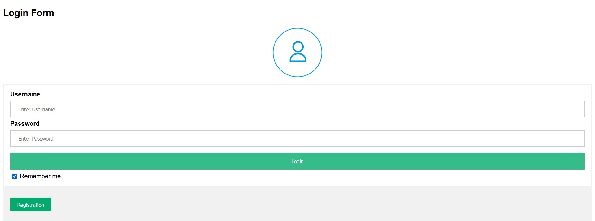
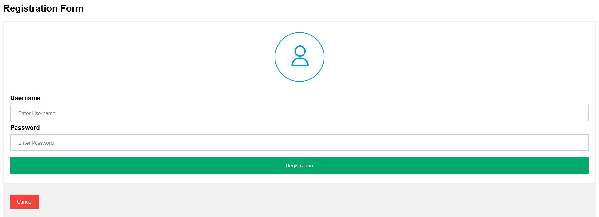
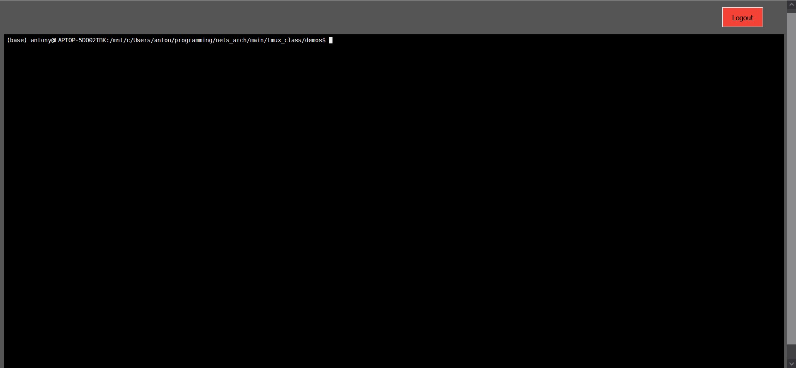
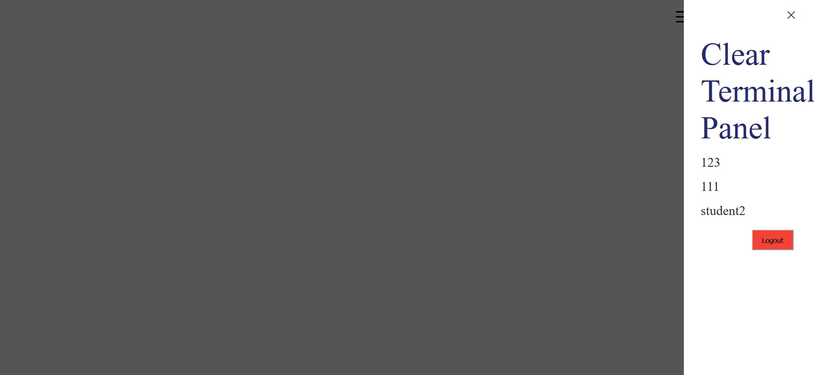

# tmux_class
Проект по курсу "Архитектура компьютерных сетей". МФТИ 2021
=====
Выполнили:  
Антон Кувалдин М05-014в 
Нигматзянов Артур M05-12г

Requirements
------------

Установка зависимостей из папки demos:

```sh
$ pip install -r requirements.txt
```
About project
---------
Проект представляет собой помощник для преподавателя по курсу программирования.
Студентам предоставляется выделенный терминал, в котором они могут выполнять задания
независимо друг от друга(tmux сессия). У преподавателя есть возможность подключиться к терминалу
любого студента и посмотреть его работу.  
Доступ к терминалам и мониторинг текущих сессий остуществляется через веб-бразуер, что позволяет 
вести работу без выполнения сторонних комманд и погружения в не относящуюся к теме курса область.


Quick Start
---------
Для начала работы необходимо запустить веб-сервер:
 
        $ cd tmux_class/demos               
        $ python3 main.py -p <admin_password>       
<admin_password> - это пароль от учетной записи администратора(преподавателя, который мониторит сессии студентов)  

После старта программы, доступ к веб интерфейсу осуществляется по пути:
        http://hostname:8700/login
   
Студентам необходимо пройти короткую регистрацию, после чего у них будет открыт терминал в браузере:
  
  
  

Преподаватель заходит в свою учетную запись с логином **admin** и паролем, указанным при старте сервера.  
Список всех текущих tmux сессий можно увидеть при нажатии на **List of Instances**  
  

При нажатии на имя сессии, преподаватель переходит в терминал студента


